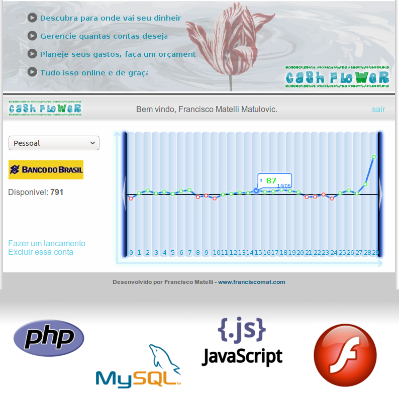

# CashFlower - Online Cash Flow System (2008)
by Francisco Mat

It was an attempt to create an inovative online Cash Flow system, with dynamic graphics. Stopped due costs, confidentiality and Flash technology limitations.

## Project history
It was an really great attempt to create a brand new product, an online cash flow system. It was stopped because Flash technology was fastly becoming outdated, it need to be replaced urgently and the project ended in demo.

Another great problem was in SQL, I just find out that the contability and double entries system is really painfull to create. I tested a lot of cash flow system and thanks to that i found the greatest software: GnuCash Finance System, an great opensource project. So that settled an end to my project and I started to use GnuCash, never regret of it, helped me a lot.

But today, looking back in time, the CashFlower was really complex and original software, with unique design, Flash + PHP communication (not trivial) and custom SQL structure, made by myself.

Thanks to prof. dr. Valdemir Aparecido Pires, from UNESP Araraquara, for constantes feedbacks and reviews

Thanks to prof. dr. Alvaro Martim Guedes, from UNESP Araraquara, for Santander Prize Submission in 2008

Francisco Matelli Matulovic - 2008